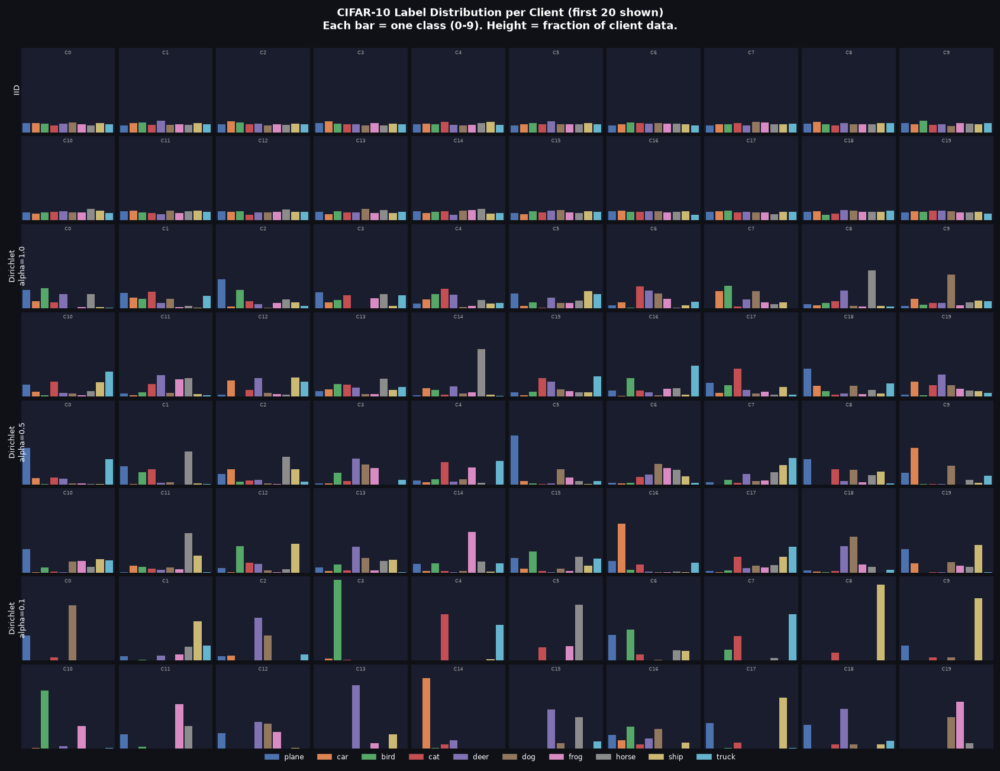
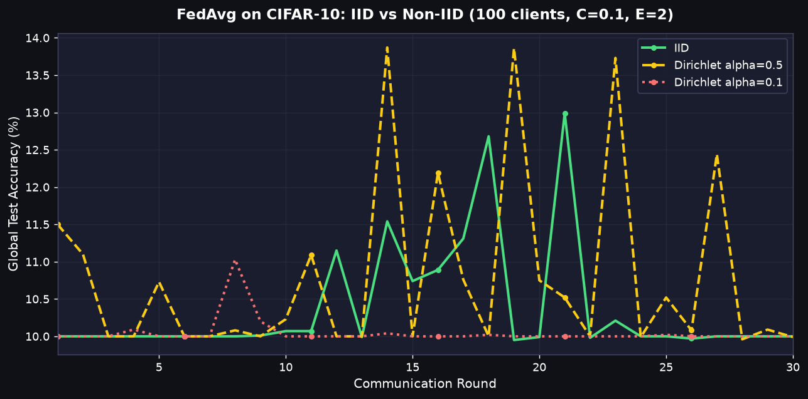
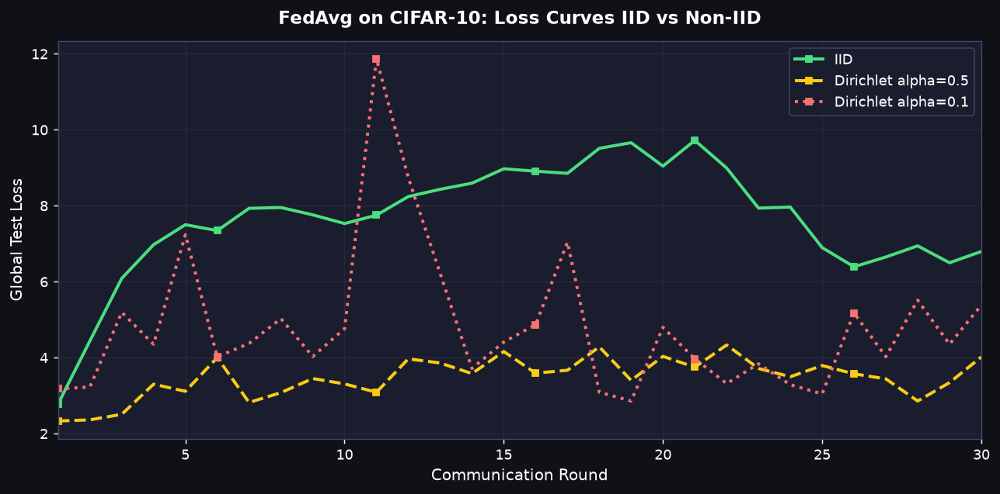

# Federated Learning — Project

This project implements **Federated Averaging (FedAvg)** from scratch, faithful to [McMahan et al. 2017](https://arxiv.org/abs/1602.05629), and explores Non-IID data partitioning strategies.

## Phase 1: FedAvg Baseline
- **Task**: MNIST
- **Model**: 2-Conv CNN (paper architecture)
- **Results**: Reached ~99% accuracy in 20 rounds.

## Phase 2: Non-IID Partitioning
- **Task**: CIFAR-10
- **Model**: ResNet-8
- **Strategies**: IID vs Dirichlet Non-IID



### Results

| Experiment | Final Accuracy | Best Accuracy |
|------------|----------------|---------------|
| IID | 10.00% | 12.99% |
| Dirichlet $\alpha=0.5$ | 9.99% | 13.87% |
| Dirichlet $\alpha=0.1$ | 10.00% | 11.03% |

*Note: The model hovered around 10% accuracy (random guess for 10 classes) after 30 rounds. The non-IID data skew significantly impacts FedAvg with standard SGD on CIFAR-10, demonstrating the need for either lower learning rates, momentum, or advanced FedAvg variants (like FedProx).*




## Quick Start

```bash
# 1. Install dependencies (requires uv — https://docs.astral.sh/uv/)
uv sync

# 2. Run Phase 1 (MNIST Baseline)
uv run python fedavg_baseline.py

# 3. Run Phase 2 (CIFAR-10 Experiments)
uv run python phase2_experiment.py
```

## Project Structure

| File | Description |
|------|-------------|
| `data_utils.py` | MNIST download + basic IID partitioning |
| `model.py` | 2-Conv CNN + weight helpers |
| `client.py` | Local trainer — SGD for E epochs |
| `server.py` | FedAvg server — weighted aggregation + broadcast |
| `fedavg_baseline.py` | Phase 1 entry point |
| `data_partitioner.py` | Advanced partitioner (IID, Dirichlet, Pathological) |
| `model_cifar.py` | ResNet-8 for CIFAR-10 |
| `logger.py` | CSV/JSON experiment logging |
| `visualize_distribution.py` | Generates label distribution charts |
| `phase2_experiment.py` | Phase 2 entry point |

## Reference

McMahan, H.B., Moore, E., Ramage, D., Hampson, S. and Agüera y Arcas, B., 2017. *Communication-efficient learning of deep networks from decentralized data.* AISTATS.
